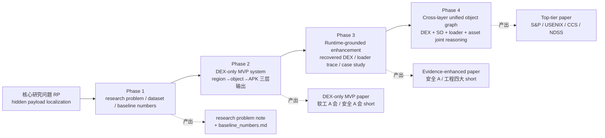

# Research Framing：顶层研究叙事与顶会路径

> 本文档是**项目唯一的研究叙事源（single source of narrative truth）**。
> [`README.md`](../README.md) §1、[`AGENTS.md`](../AGENTS.md) §0、[`docs/project_constraints.md`](project_constraints.md) "研究定位" 段、[`docs/method/ours_method_spec.md`](method/ours_method_spec.md) §1–§2 **一律引用本文件**，不再各自复述。
>
> 任何涉及"研究问题 / 四阶段路线 / 核心卖点 / 顶会定位"的改动**必须回写本文件**，其他文档只做引用与摘要。

## 0. 出处

本文件将《安卓加壳工作-总研究计划-运开.pdf》（以下简称 "总计划 PDF"）文本化、结构化，并加入"顶会水准自检"条目，便于 AI agent 在实现/实验/写作前强制对齐。PDF 属于二进制资产，不便检索；本文件是**可检索、可 commit diff、可作为 agent 强制读物**的权威版本。

**投稿执行层另见** [`docs/paper_submission_plan.md`](paper_submission_plan.md)：本文件管"**研究做什么**"（RP / Phase / 卖点），投稿计划管"**下一篇论文投哪里、什么时候投、谁做什么**"（Stage A/B / deadline / 6 周冲刺 / 分工）。两者边界与同步约束见本文件 §8。

---

## 1. 研究背景与核心问题

### 1.1 背景

Android 加壳生态已经从**单体壳（single packer）**演化到**复合加壳（multi-layer / cross-layer packing）**：

- DEX 层：payload 可被拆分、编码、加密、结构擦除（signature strip / magic camouflage），以 `assets/*` / `res/raw/*` 等形态落地，运行时由 shell DEX 通过 `DexClassLoader` / `PathClassLoader` 恢复加载。
- SO 层：shell 逻辑下沉到 native，加密/反射通过 JNI 完成；SO 本身可能再套 UPX-like 变换。
- Loader 层：AndroidManifest 声明的 Application / Service 入口指向 shell，真正业务类在运行时才被创建。
- Asset / Resource 层：payload 伪装成 PNG / ttf / db 等"无害资源"。

### 1.2 现有工作的不足

- 绝大多数已发表工作把问题设定为 **"APK 是否加壳"的二分类**，而不是**"加壳 APK 内部隐藏可执行 payload 在哪里"的定位**。
- 即使给出 yes/no，也难以告诉分析师 "payload 在 `assets/a.db` 第 4 KiB 起的连续 12 KiB"；这类**可行动的证据**恰恰是静态/动态混合分析、反病毒报告、司法取证等下游任务的核心需求。
- APKiD 等社区规则能识别"是什么壳"，但不能告诉你**恶意 payload 藏在哪一个 object / 哪一段 offset**。

### 1.3 本项目的核心研究问题（Research Problem, RP）

> **Weakly-Supervised Static Localization of Hidden Executable Payloads in Packed Android Apps**：
> 给定一个加壳 Android APK 与仅有 APK 级二分类弱标签 (`packed / benign`)，如何在 **APK 级、typed-instance 级、region 级**三个粒度上自动且可解释地定位隐藏的可执行 payload，**不依赖人工 region/object 标注**，并在未见过的加壳家族 / 变换上保持鲁棒性？

子问题：

- **RP1**：DEX-only 场景下的 byte-level 定位如何脱离"手工阈值/规则/YARA"并学到可泛化的语义表示？我们用 **typed-instance MIL** 把 APK 当 bag、6 类对象当 typed instance，从弱标签反传出 instance-level 定位。
- **RP2**：runtime evidence（recovered DEX、loader trace、文件落地）如何低成本地**增强**静态标签与静态模型，而非取代？
- **RP3**：跨层（DEX ↔ SO ↔ loader ↔ asset）的隐藏关系如何统一表达为**对象图**并联合推理？
- **RP4**：评测协议如何既可复现（synthetic strong label）又可信（真实样本、adversarial unseen-packer 泛化、**Leave-One-Packer-Out**）？

> **任务粒度命名约定**（2026-05-06 起，与 [`docs/method/ours_method_spec.md`](method/ours_method_spec.md) §12 对齐）：原文 "object" 重命名为 **typed instance**，类型来自 [`labeling/injected_packer_adapter.py`](../src/android_packer/labeling/injected_packer_adapter.py) 的 `_PAYLOAD_KINDS` ∪ `_LOADER_KINDS` = `{encrypted_dex, extracted_method_body, metadata_table, compressed_payload, shim, native_stub}`。这一命名让 MIL bag-instance 公式化更直接，并让"per-type 性能拆分"成为论文 Table 4 的标准维度。

---

## 2. 总体研究路线（四阶段 Phase 1 → Phase 4）

### 2.1 流程图



### 2.2 Phase 1 — Research problem & baseline numbers（已完成 + 收尾）

- **目标**：把研究问题定义清楚；把"现有 baseline 在本任务上的真实数字"拿出来作为后续 Ours 的对比锚点。
- **Deliverables**：
  - `docs/method/problem_definition.md` ✅
  - `docs/method/threat_model.md` ✅
  - `docs/method/experiment_goals.md` ✅
  - `docs/method/baseline_numbers.md`：entropy / sanity_rules / **ngram_logreg**（F0b 已落地 2026-04-29 commit `c7e2a65` → `28f2882`：FeatureHasher n=262144 解决 OOM，in-sample Region AUROC=0.9469, Region Precision=0.8561, IoU=0.9255, Boundary Error=60 KB）/ **signature_strip 硬对抗族**（F0c-1 已落地 commit `83110d7`）✅；**APKiD 真实扫描数字** + **benign-混入 APK AUROC** 由 F0c-full / F0d 补完（Week 2 任务）。
- **硬约束**：任何"Ours 强于 baseline"的断言**必须**引用 `baseline_numbers.md` 的具体数字。

### 2.3 Phase 2 — DEX-only MVP system（当前阶段）

- **目标**：产出一个在 DEX-only 场景下能输出 region → object → APK 三层定位 + offset 预测的系统原型 + 一篇 MVP 论文。
- **Deliverables（系统）**：
  - 完整的 synthetic packer（≥ 5 transform families，含至少 1 个 signature-strip 硬对抗族）
  - DexBERT-Loc 方法：byte-level MLM pretrain + **DEX grammar-aware auxiliary supervision**（见 §4）+ learned object aggregator
  - seen / unseen-packer / unseen-package 三种 split 协议
  - 对应的 ablation 清单
- **Deliverables（论文）**：DEX-only MVP 四段式（见 §3）。
- **目标投稿**：软件工程 A（ICSE / FSE / ASE）short/main；或安全 A 会 short。**主要目的是把研究问题与数据构建方法打立起来**。

### 2.4 Phase 3 — Runtime-grounded enhancement

- **目标**：把动态证据（recovered DEX hash / classloader call / 文件落地 / 反射调用链）回投到静态对象，增强**标签**与**模型特征**，并在真实样本上做案例分析。
- **Deliverables**：
  - runtime trace schema + 至少 20 个真实加壳 APK 的 runtime evidence
  - 静态↔动态对齐算法 + alignment 准确性指标
  - 以 Phase 2 系统为底，新增 runtime-grounded 输入通路，产出第二版系统 + 论文
- **目标投稿**：安全 A（CCS / NDSS）或工程四大 short。

### 2.5 Phase 4 — Cross-layer unified object graph（终极目标）

- **目标**：把 DEX 逻辑单元（class_def / code_item / string_ids）、SO 导出表、loader 声明、asset/resource 携带的 payload，统一建模为**异构对象图**，在图上做 joint reasoning；输出 APK/object/region/edge 四层证据。
- **Deliverables**：
  - 异构图 schema（node types: dex_item / so_export / loader_entry / asset；edge types: decrypt / load / reflect / contain）
  - 图神经网络定位模型 + 对抗鲁棒性评测
  - 跨层 ablation：去掉任一层看性能下降
- **目标投稿**：S&P / USENIX Security / CCS / NDSS 主会长文。

---

## 3. MVP 论文四段式（Phase 2 投稿版的必写内容）

> 下面四段是"写 paper 时强制要答的问题"。Agent 在做 F1–F8 批次时，每个 commit 都必须能被归到这四段的某一小节；否则该批次的必要性需要在 commit message 里解释。

### 3.1 研究对象

- **对象**：DEX-only 场景下的 Android 加壳 APK。shell DEX + 一个或多个 hidden payload object。
- **任务粒度**：APK 二分类 / object 排序 / region 偏移范围。
- **不包含**：纯 native payload / 网络下发二阶段 / 完整自动脱壳。

### 3.2 核心方法（PseudoHunter；Pseudo-code BERT + typed routing + normality MIL）

> **2026-05-26 状态更新**：Phase 2 当前论文主线已经从 PayloadHunter-Lite / TI-MIL 切换为 **PseudoHunter**。TI-MIL、grammar-aware byte pretraining、packed/unpacked contrastive pretraining 均保留为历史方法资产和消融/后续路线，不再作为当前 ACSAC 论文的主 claim。

一句话：*"Weakly-supervised static detection and entry-level localization of packed Android applications via Android-specific pseudo-instruction language models, typed path routing, hard-benign normality learning, and normality-conditioned MIL."*

当前三个卖点：

1. **Android-specific pseudo-instruction naturalness**
   - APK regions 被解码为 Dalvik pseudo-opcodes、ARM64 pseudo-instructions 和 raw-byte tokens。加密/压缩 payload 在线性解码后会产生 invalid opcode、abnormal operand、impossible branch/index 等非自然序列。
   - 共享 PseudoCodeBERT 在 benign APK 上做 spMLM 预训练，学习“正常 APK entry/region”的伪指令分布。
   - 单变量消融：Dalvik-only / ARM64-only / byte-only / Dalvik+byte / naive three-path。

2. **Typed path routing + path dropout**
   - DEX-like regions 优先 Dalvik，ELF/native regions 优先 ARM64，archive/asset/resource regions 主要走 byte，但 byte 作为 fallback 视图而非默认最高权重。
   - 训练期 path dropout 防止 MIL head 过度依赖某一路径。
   - 当前最强 LOPO 结果：routed three-path + dropout，mean APK AUROC=0.9582，detection=99.0%，normality MRR=0.4367。

3. **Hard-benign normality learning for app-disjoint generalization**
   - strict DPT-v2 暴露了复杂 benign APK 被误打高分的问题；方法主线因此转为显式扩大 modern hard benign normality。
   - 24 个 F-Droid APKiD-clean hard benign 加入训练后，strict clean DPT 从原始 routed baseline AUROC=0.6000 / benign mean=0.8521 修复到 AUROC=0.9280 / benign mean=0.1661 / FPR@95TPR=0.3158。
   - AndroZoo modern Play-market benign replication 正在排队：CSV 下载中，完成后自动下载 50 APK、APKiD 审计并跑同一 strict DPT 协议。

以下 TI-MIL 三件套是 2026-05-06 到 2026-05-10 的历史路线，保留用于追溯和消融：

四个卖点（**2026-05-10 更新**，在 2026-05-06 三卖点基础上加入 attention-anomaly scoring 关键发现；详见 §4 自检 + [`docs/method/ours_method_spec.md`](method/ours_method_spec.md) §12）：

1. **Typed-Instance Multiple-Instance Learning over the APK bag**（卖点 1，新方法组件 + 新问题表述）
   - APK 当 bag；instances 是 6 类 typed objects (`encrypted_dex / extracted_method_body / metadata_table / compressed_payload / shim / native_stub`)，类型标签**零成本**来自 [`labeling/injected_packer_adapter.py`](../src/android_packer/labeling/injected_packer_adapter.py) 的 `_PAYLOAD_KINDS ∪ _LOADER_KINDS`，无新增 schema、无人工标注。
   - 在仅有 APK 级弱标签的条件下，通过 top-k / noisy-or / gated-attention (ABMIL, Ilse 2018) 三种池化策略反传出 **instance-level localization scores**，是论文唯一对外承诺的 "解释层"。
   - 单变量消融：`pooling ∈ {mean, max, topk, noisy_or, attention}`、`typed_routing ∈ {on, off}`，对照 PayloadHunter-Lite 的 plain attention aggregator。

2. **Attention-Anomaly Scoring for Localization**（卖点 2，**2026-05-10 新发现**，核心推理时创新）
   - 关键洞察：bag-only MIL 的 attention 学到的是"哪些 instance 对 bag 判别贡献最大"——这些恰恰是**典型的/常见的 benign objects**（AndroidManifest, 资源文件等），而**非 payload**。Payload 因为是异常的、跨 family 变化大的 object，获得**低 attention**。
   - 推理公式：$s_i = (1 - \alpha_i / \max_j \alpha_j) \times \sigma(\hat{y}_{bag})$，即"低注意力 + packed bag → 高可疑度"。
   - 自适应阈值：$\tau_{inst} = \tau \times \sigma(\hat{y}_{bag})$，自动适配 score 范围。
   - 方向自动检测（`attention_auto`）：在第一个有标签的 bag 上检测 positive instances 的 attention 是高还是低，锁定方向。
   - **实验验证**：在 2-task pilot 上从 AUROC=0.02（错误方向）跳到 0.996（正确方向）；84-task LOFO 最终 AUROC=0.869。
   - 单变量消融：`scoring_mode ∈ {instance_logit, attention, attention_x_bag, attention_anomaly, attention_auto}`。

3. **DEX Grammar-aware Auxiliary Supervision**（卖点 3，新监督信号）
   - byte-level MLM + **DEX item-type span 分类辅助 CE**（10 类：`header / string_ids / type_ids / proto_ids / field_ids / method_ids / class_defs / code_item / string_data / other`，标签来自 stdlib parser [`features/dex_item_parser.py`](../src/android_packer/features/dex_item_parser.py)）。
   - **零成本**：parser 仅在 benign DEX 上运行，packed DEX 解析失败 → 自动排除（与 §4.2 "不依赖 synthetic" 完全一致）。
   - 单变量消融：λ_item ∈ {0.0, 0.2, 0.5}；与 PayloadHunter-Lite 的"无任何辅助监督"对照。

3. **Packed/Unpacked Differential Contrastive Pretraining**（卖点 3，新预训练目标；2026-05-06 升级，替换原 saliency-based offset）
   - 用 Track B v2 已交付的 **18 个 packed/unpacked APK 配对**（`label_source = {path_a_injected: 9, path_b_diff: 9}`）做 InfoNCE：
     - **`h_app` 头**：`benign_i ≈ packed_i`（同一 app semantic 不变）—— 让 encoder 把"app 身份"和"加壳残差"解耦。
     - **`h_pack` 头**：`z_pack(packed_i) - z_pack(benign_i)` 捕捉 **packing residual**，作为 packed-detection 的可分离子空间。
   - 把"packing"重新定位为一种 **structured domain augmentation**，而非 "label noise to ignore" —— 这是 framing 上对 reviewer 最强的差异化点。
   - 单变量消融：`contrastive ∈ {off, h_app only, h_pack only, both}`，对照不做 contrastive 的 from-scratch 训练。

> **降级：原"learned object aggregator + saliency-based offset"** 被吸收进卖点 1 的 attention pooling，单独作为消融项 (`ours_attention_only`) 出现；原 PayloadHunter-Lite 整体降为消融 baseline (§4.3)。

**总损失**（标准化）：

```
L_total = L_mil_apk + λ₁·L_diff_pseudo_span + λ₂·L_sparsity
        + λ₃·L_item_type_aux + λ₄·L_contrastive
```

其中 `L_mil_apk` 是 BCE-with-logits on bag logit；`L_diff_pseudo_span` 用 Path B diff 产出的 pseudo-span 软监督 instance scores（仅在配对数据上启用）；`L_sparsity` 是 attention 熵正则；`L_item_type_aux / L_contrastive` 仅在预训练阶段启用。

### 3.3 实验协议

- **数据**：benign APK + synthetic packed APK（≥ 5 transform families，含 `signature_strip`）；benign 对照与足够 seed（≥ 20）保证 APK AUROC 可算。
- **Split 协议**：
  - `same_set`（sanity check，不作正式结论）
  - `holdout_transform`（主结果；RQ1/RQ2）
  - `holdout_package`（RQ2 泛化补充）
  - `adversarial_variants`（RQ3；按硬 transform family 逐个报告）
- **统计显著性**：seed ≥ 20；主要指标报 mean ± std；重要对比跑 bootstrap ≥ 100 次或 paired t-test。

### 3.4 主指标

- **APK**：Detection Rate / FPR / AUROC。
- **Object**：F1 / Top-1 / Top-3 / MRR。
- **Region**：Precision / Recall / F1 / AUROC。
- **Localization**：IoU / Boundary Error / Offset Hit Rate。
- **所有数字必须按 transform_family 拆分**（既现有 `by_transform` 结构），不允许只报 overall 平均。

---

## 4. 方法创新点的顶会水准自检

> 目的：每当 agent 在批次里添加/修改一个"卖点"，必须逐条勾过这张自检表；任一勾不过就回 reviewer 角色 debate。

### 4.1 自检清单（每条必须答"是"）

- [ ] 该卖点是否对应一个明确的 **新方法组件** 或 **新监督信号**？（不是 engineering detail）
- [ ] 是否能在单变量 **消融实验** 里观测到显著 Δ？
- [ ] 是否有清晰的 **baseline 对比对手**（不是只和自己不同版本比）？
- [ ] 是否 **不会** 被审稿人质疑 "这只是对 synthetic 量身定做"？
- [ ] 是否 **不依赖** 不可复现的专有数据/闭源工具？
- [ ] 是否与 Phase 3/4 的后续工作 **兼容**（不会堵死下一阶段路径）？

### 4.2 当前 PseudoHunter 卖点的自检结果（2026-05-26）

**卖点 1：Android-specific pseudo-instruction naturalness**
- ✅ 新方法组件：Dalvik / ARM64 / byte 三路 pseudo-instruction decoder + shared PseudoCodeBERT。
- ✅ 单变量消融：Dalvik-only、ARM64-only、byte-only、Dalvik+byte、naive three-path、routed three-path。
- ✅ 对手：entropy threshold、byte histogram/XGBoost、APKiD known-signature check、历史 TI-MIL / PayloadHunter-Lite。
- ✅ 非 synthetic 定制：spMLM 来自 benign APK，Track B / Happer paired data 只提供弱差分监督，不依赖 synthetic 生成器标签。
- ✅ 可复现：`decoders/*`、`models/pseudo_code_bert.py`、`models/fusion_encoder.py`、`scripts/experiments/run_lopo_eval.py`。
- ✅ Phase 3/4 兼容：pseudo-instruction normality 可以接 runtime-recovered DEX / SO / asset evidence，作为跨层图节点特征。

**卖点 2：Typed path routing + path dropout**
- ✅ 新方法组件：region-type routing prior + training-only path dropout，解决 naive three-path 融合在 Qihoo 等 fold 上崩溃的问题。
- ✅ 单变量消融：naive three-path AUROC=0.8281 vs routed three-path + dropout AUROC=0.9582；Dalvik+byte AUROC=0.9025。
- ✅ 对手：single-path 和 naive concat 都是同一 backbone 的明确对照。
- ✅ 非 synthetic 定制：routing 来自 APK entry/region 类型，不来自 synthetic label。
- ✅ 可复现：`FusionEncoderConfig.path_dropout_prob` / `use_region_type_routing` + `tests/unit/test_fusion_encoder.py`。
- ✅ Phase 3/4 兼容：后续可从 fixed routing 扩展为 learned path confidence。

**卖点 3：Hard-benign normality learning**
- ✅ 新监督/数据组件：APKiD-audited modern hard benign pool，训练目标显式学习复杂 benign APK 正常性。
- ✅ 单变量实验：strict DPT-v2 原始 routed baseline AUROC=0.6000 / benign mean=0.8521；9 hard benign AUROC=0.9335 / benign mean=0.4892；24 F-Droid hard benign AUROC=0.9280 / benign mean=0.1661 / FPR@95TPR=0.3158。
- ✅ 对手：不加 hard benign、9-hard-benign、24-F-Droid-hard-benign、待跑 AndroZoo-hard-benign。
- ✅ 非 synthetic 定制：hard benign 来自 F-Droid / AndroZoo modern benign APK，APKiD 清洗，不来自 synthetic。
- ✅ 可复现：`outputs/experiments/hard_benign/manifest_fdroid_expanded_apkid.json` 与 strict DPT result JSON。
- ✅ Phase 3/4 兼容：hard benign normality 是 runtime-grounded / cross-layer 版本的基础负例分布。

### 4.2b 历史 TI-MIL 三卖点自检结果（2026-05-06 重写，已降级）

**卖点 1：Typed-Instance Multiple-Instance Learning over the APK bag**
- ✅ 新方法组件：3 个 MIL 池化（top-k / noisy-or / gated-attention ABMIL）+ 6 类 typed instance per-type sub-head；**APK = bag** 公式化是 Android packer 文献中第一次出现。
- ✅ 单变量消融：`pooling ∈ {mean, max, topk, noisy_or, attention}` × `typed_routing ∈ {on, off}` × `feature_attention ∈ {on, off}`。
- ✅ 对手：PayloadHunter-Lite (Stage A "no MIL / no typed") + entropy / sanity_rules / APKiD / ngram_logreg。
- ✅ 非 synthetic 定制：typed instance 标签来自 `_PAYLOAD_KINDS ∪ _LOADER_KINDS`，**Track B v2 18/18 真实 packer 配对天然存在**。
- ✅ 可复现：`models/{mil_head, typed_encoder, ours}.py` + `tests/unit/test_{mil_head, typed_encoder, ours_model}.py`（39 单测，39/39 绿，2026-05-06）。
- ✅ Phase 3/4 兼容：MIL bag 视角天然支持 Phase 4 的 cross-layer object graph（bag → graph readout）。

**卖点 2：DEX Grammar-aware Auxiliary Supervision**（前身：§5 F2-reframing 卖点）
- ✅ 新监督信号：byte MLM + 10 类 item-type per-token CE，标签由 stdlib parser ([`features/dex_item_parser.py`](../src/android_packer/features/dex_item_parser.py)) 在 benign DEX 上免费产出。
- ✅ 单变量消融：λ_item ∈ {0.0, 0.2, 0.5}（`ours_no_item_type_pretrain` vs `ours_full`）。
- ✅ 对手：纯 MLM (`ours_mlm_only`) + 无 pretrain (`ours_no_pretrain`)。
- ✅ 非 synthetic 定制：辅助标签由 DEX 规范决定，与 synthetic 生成器无关；packed DEX parser 失败即被自动剔除（保持 benign-only MLM 契约）。
- ✅ 可复现：`models/item_type_head.py` (5 单测绿) + `training/pretrain_mlm.py`（landing）。
- ✅ Phase 3/4 兼容：grammar 表示与 runtime 证据正交。

**卖点 3：Packed/Unpacked Differential Contrastive Pretraining**（2026-05-06 新增，替换原 saliency-offset 卖点）
- ✅ 新预训练目标：双头 InfoNCE，把 packing 当 structured domain augmentation；用 Track B v2 已交付的 **18 packed/unpacked pair**（`label_source = {path_a_injected: 9, path_b_diff: 9}`）天然形成正负对。
- ✅ 单变量消融：`contrastive ∈ {off, h_app only, h_pack only, both}` × `pair_source ∈ {path_a, path_b, mixed}`。
- ✅ 对手：from-scratch encoder + ngram_logreg + PayloadHunter-Lite（无对比学习）。
- ✅ 非 synthetic 定制：Track B 来自 9 个 F-Droid benign × 2 真实 commercial-grade packer (S5/S6)，**含 1 个 Path A 注入 + 1 个 Path B diff 验证 = IoU cross-check** 是论文 §5 最强单一 ground-truth 数据点。
- ✅ 可复现：`training/contrastive.py`（landing；F-MIL-d）。
- ✅ Phase 3/4 兼容：`h_app` 头可被 Phase 4 用作 cross-layer object graph 的 node embedding 起点。

### 4.3 被**降级 / 退出**的候选卖点（诚实记录，避免再误入）

- ❌ **"PayloadHunter-Lite = handcrafted 15-dim + 浅 MLP + plain attention aggregator" 作为正式 Ours**：2026-05-06 降级 —— 经反复审视该方案"infrastructure 9/10 vs method novelty 3/10"，本质是 learned heuristic，不足支撑顶会方法卖点。**保留为消融 baseline**（"no MIL / no typed routing / no grammar aux / no contrastive" 的对照点；位于 [`models/payload_hunter_lite.py`](../src/android_packer/models/payload_hunter_lite.py) 与 [`baselines/payload_hunter_lite.py`](../src/android_packer/baselines/payload_hunter_lite.py)，不删）。
- ❌ **"saliency-based offset 作为独立卖点"**：2026-05-06 吸收进卖点 1 的 attention pooling（attention weights 自身即是 instance-level localisation scores），单独作为消融项 `ours_attention_only` 出现。
- ❌ **"8 条 scalar DEX 结构特征作为 gated fusion 输入"**：太工程化、创新性不足、易被审稿人认为"就是规则"；已降级为**可选消融**（`use_structural` 默认 False）。保留代码仅用于消融对比，不进论文卖点。
- ❌ **"按 DEX 逻辑单元（class_def / 相邻 code_item）做跨-region 结构化 attention"**：物理事实是加壳后逻辑结构即失效，会退化为"有逻辑边→benign"的 0/1 flag；且会提前透支 Phase 4 的核心卖点（logical/cross-layer graph）。**MVP 不做；Phase 4 统一作为 cross-layer object graph 的一部分落地**。

---

## 5. F2 reframing：把 "DEX-aware scalar fusion" 升级为 "grammar-aware auxiliary supervision"

> 这是 §4.2 卖点 2 落地到批次计划 / 方法规格书的具体映射。对应修改已同步到 [`docs/method/ours_method_spec.md`](method/ours_method_spec.md) §2.2 / §3.2.1 / §5.1 / §6.3 / §7 F2 与 F5。

### 5.1 具体做什么

- **新增 `src/android_packer/features/dex_item_parser.py`（纯 stdlib）**：最小 DEX parser，解析 header + map_list，返回 `List[DexItemSpan(offset, size, item_type)]`，覆盖至少 9 个 item type：`header / string_ids / type_ids / proto_ids / field_ids / method_ids / class_defs / code_item / string_data / other`。
- **为每个 region 计算 token-level item-type label**：`labels ∈ {ID_PAD, 0..N_ITEM_TYPES-1}`，shape = `[L]`，和 MLM token 同级。
- **在 `training/pretrain_mlm.py` 里增加辅助 head**：`ItemTypeHead(hidden_size → n_item_types)`，辅助 loss = `cross_entropy(logits, item_type_labels, ignore_index=ID_PAD)`；总 loss = `L_mlm + λ * L_item`（λ 默认 0.2，可调）。
- **消融**：`ours_no_item_type_pretrain`（λ=0）与 `ours_full`（λ=0.2）单变量对比。

### 5.2 为什么合规

- **不碰 synthetic**：item-type label 仅来自 benign DEX parser 输出；packed 数据 parser 会失败 → 直接排除，与 F5 "benign-only MLM" 契约一致。
- **不 over-fit**：label 来源是 DEX 规范定义，对"未见 packer"无泄漏。
- **不堵 Phase 4**：学到的 grammar 表示是"局部字节结构"，与 Phase 4 的"跨层对象图"是正交的。

### 5.3 8 条 scalar 的处置

- **保留代码**：`features/dex_features.py` + `FusionHeadConfig.structural_feature_dim` 代码路径不删。
- **默认关闭**：`OursBaselineConfig.use_structural: bool = False`；`GatedFusionHead` 在 `use_structural=False` 时 bypass structural 输入（全 0 或直接跳过 concat）。
- **消融位**：`ours_with_scalar_struct`（打开 structural 输入）作为一项消融，只用于证明"8 条 scalar 对最终指标无显著增益（或增益远小于 item-type aux loss）"。

---

## 6. Agent 强制对齐清单（给执行批次的 AI 协作者）

任何 `feat: / experiment: / data:` commit 提交前，必须能把本次改动 **精确落到本文件的 Phase / Deliverables / 卖点自检 / RQ 之一**：

1. 本次改动对应哪个 Phase？（Phase 1 / 2 / 3 / 4）
2. 对应的 Deliverable 在本文件哪一节？
3. 若涉及方法创新（§4 卖点之一），§4.1 自检 6 条是否全部为"是"？
4. 若涉及数据/实验，对应的 RQ 是 RP1/2/3/4 中的哪一个？
5. 若是"新卖点"，在 §4 补充一小节 + §4.2 对应自检结果。

如果任一问题答不上来，**先提 docs PR 更新本文件，再提 feat PR**。这是硬约束。

---

## 7. 与其他文档的引用关系

| 本文件章节 | 被下游文档引用的位置 |
|---|---|
| §1 研究问题 | [`README.md`](../README.md) §1、[`project_constraints.md`](project_constraints.md) "研究定位" |
| §2 四阶段路线 | [`project_progress.md`](project_progress.md) "阶段升级标准"、[`AGENTS.md`](../AGENTS.md) §0、[`paper_submission_plan.md`](paper_submission_plan.md) §1 |
| §3 MVP 四段式 | [`ours_method_spec.md`](method/ours_method_spec.md) §1–§2 |
| §4 卖点自检 | [`ours_method_spec.md`](method/ours_method_spec.md) §2.2、[`AGENTS.md`](../AGENTS.md) §8 顶会 Checklist |
| §5 F2 reframing | [`ours_method_spec.md`](method/ours_method_spec.md) §3.2.1 / §5.1 / §6.3 / §7 F2, F5 |

本文件一旦变更，上述下游文档需要在下一个 PR 中**同步**引用与摘要内容，否则视为文档漂移。

---

## 8. 投稿执行层：另见 `paper_submission_plan.md`

本文件只管"**研究做什么**"；"**下一篇论文投哪里、什么时候投、谁做什么**"这一执行面由 [`paper_submission_plan.md`](paper_submission_plan.md) 管辖。两者边界：

- 本文件 §2.3 Phase 2 / §2.4 Phase 3 声明**研究目标**（DEX-only MVP / runtime-grounded enhancement）。
- [`paper_submission_plan.md`](paper_submission_plan.md) 把这两个 Phase 映射到**具体会议、deadline、6 周冲刺任务、你/agent 分工**。

当前执行策略摘要（详见该文件 §1）：

- **Stage A（保底）**：ACSAC 2026 full paper，deadline 约 2026-06-03，对应 Phase 2 的 MVP 成果。
- **Stage B（顶会）**：USENIX Security '27 Cycle 2（约 2026-10）或 NDSS '27 summer（约 2026-07），对应 Phase 2 扩写 + Phase 3 的 runtime-grounded 证据。

任何涉及会议切换 / deadline 调整 / 冲刺计划重排的改动**只回写** `paper_submission_plan.md`，不动本文件。

---

## 9. L47 Integrity Fix & Improvement Plan（2026-05-11 新增）

### 9.1 Ground-truth leak discovered and fixed

Experiment-audit (2026-05-11) discovered that `_predict_impl()` passed
ground-truth `label_id` to type routing at inference time, inflating all
metrics to 1.000. **All pre-L47 Track B/C numbers are invalid.** Post-fix
honest numbers are in [`docs/method/improvement_plan_L47.md`](method/improvement_plan_L47.md) §5.

### 9.2 卖点 4：Attention-Anomaly Scoring（2026-05-11 新增，需重新审视）

L47 fix 揭示了 attention 方向在 region/object 粒度上不一致的问题。
**原始 "attention-anomaly" 叙事（低 attention = 异常 = payload）在 GT routing fix 后不再成立。**
修复后的经验证据表明 packed instances 获得**高 attention**（`attention_x_bag` Region AUROC=0.924），
而非低 attention。这与 Sultani et al. (CVPR 2018) 的 MIL 异常检测范式一致，
而非 CAVGA (ECCV 2020) 的 attention inversion。

**下一步方法改进路线**见 [`docs/method/improvement_plan_L47.md`](method/improvement_plan_L47.md)：
- Tier 1A: DEX 结构特征扩展（利用已有 `dex_item_parser.py`）
- Tier 1B: Track A+B 混合训练
- Tier 1C: DEX section 类型作为 attention embedding
- Tier 2A: DEX Section-level Instance MIL（最大 MRR 提升潜力）
