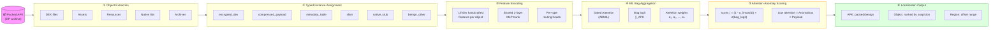

```mermaid
flowchart LR
    %% Input
    APK[("📦 Packed APK<br/>(ZIP archive)")]

    %% Stage 1: Extraction
    subgraph EXTRACT["① Object Extraction"]
        direction TB
        OBJ1["DEX files"]
        OBJ2["Assets"]
        OBJ3["Resources"]
        OBJ4["Native libs"]
        OBJ5["Archives"]
    end

    %% Stage 2: Regioning + Typing
    subgraph TYPE["② Typed Instance Assignment"]
        direction TB
        T1["encrypted_dex"]
        T2["compressed_payload"]
        T3["metadata_table"]
        T4["shim"]
        T5["native_stub"]
        T6["benign_other"]
    end

    %% Stage 3: Feature + Encoding
    subgraph ENCODE["③ Feature Encoding"]
        direction TB
        FEAT["15-dim handcrafted<br/>features per object"]
        TRUNK["Shared 2-layer<br/>MLP trunk"]
        HEADS["Per-type<br/>routing heads"]
    end

    %% Stage 4: MIL Pooling
    subgraph MIL["④ MIL Bag Aggregation"]
        direction TB
        ATTN["Gated Attention<br/>(ABMIL)"]
        BAG["Bag logit<br/>ŷ_APK"]
        WEIGHTS["Attention weights<br/>α₁, α₂, ..., αₙ"]
    end

    %% Stage 5: Anomaly Scoring
    subgraph SCORE["⑤ Attention-Anomaly Scoring"]
        direction TB
        FORMULA["score_i = (1 - α_i/max(α)) × σ(bag_logit)"]
        RANK["Low attention = Anomalous = Payload"]
    end

    %% Stage 6: Output
    subgraph OUTPUT["⑥ Localization Output"]
        direction TB
        OUT_APK["APK: packed/benign"]
        OUT_OBJ["Object: ranked by suspicion"]
        OUT_REG["Region: offset range"]
    end

    %% Connections
    APK --> EXTRACT
    EXTRACT --> TYPE
    TYPE --> ENCODE
    ENCODE --> MIL
    MIL --> SCORE
    SCORE --> OUTPUT

    %% Styling
    style APK fill:#f9f,stroke:#333
    style SCORE fill:#ffd,stroke:#f80
    style OUTPUT fill:#dfd,stroke:#393
```
